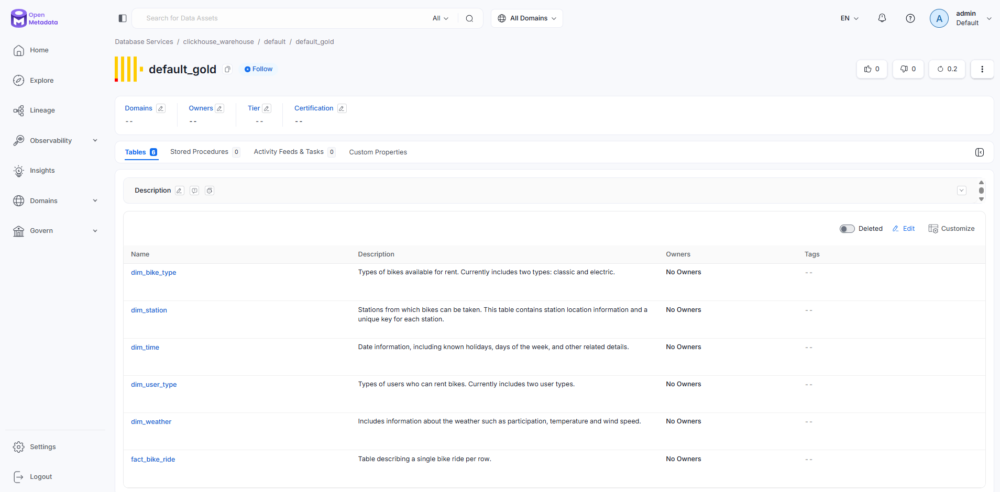
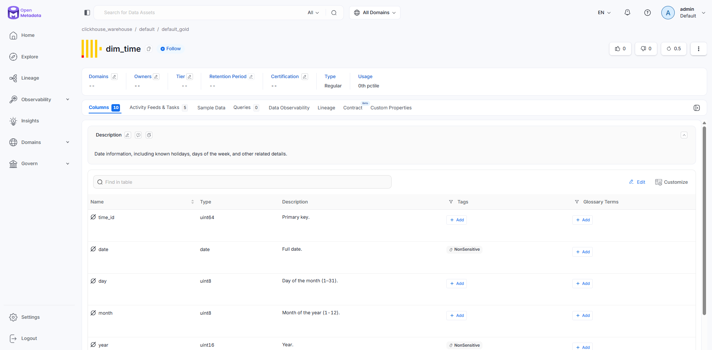
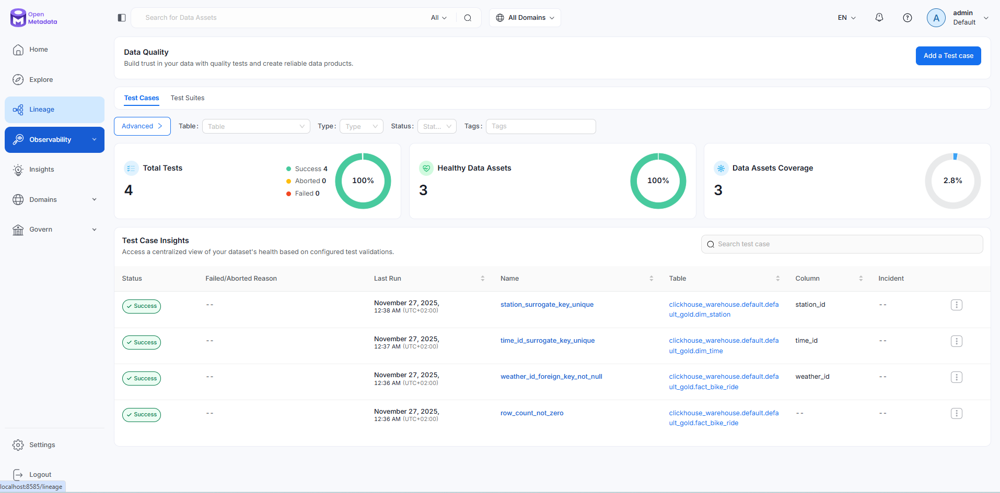
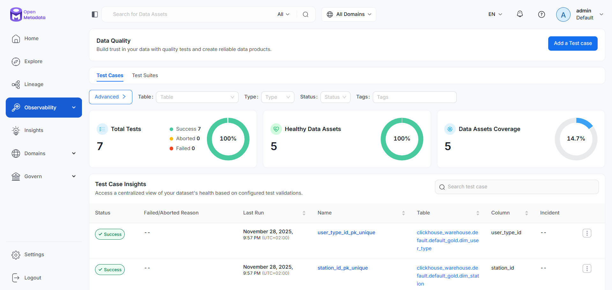
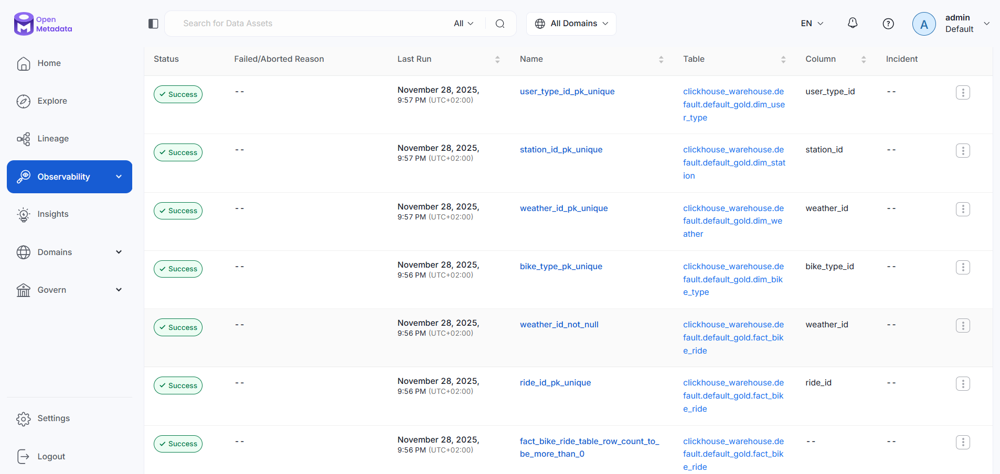

# OpenMetadata

## Steps to establish the connection between ClickHouse and OpenMetadata

1. Open Airflow (http://localhost:8080) and log in using:
   * Username: admin
   * Password: admin
3. Trigger DAGs in this order:
   1. `holidays_load`
   2. `bike_data_ingestion`
   3. `clickhouse_bronze_loads`
   4. `dbt_gold_refresh`
   Weather ingestion DAG will be triggered automatically.


4. Execute  ```docker exec -it clickhouse clickhouse-client``` and run the following queries:
```
CREATE ROLE role_openmetadata;
CREATE USER service_openmetadata IDENTIFIED WITH sha256_password BY 'omd_very_secret_password';
   
GRANT SELECT, SHOW ON system.* to role_openmetadata;
GRANT SELECT, SHOW ON default_gold.* to role_openmetadata;
GRANT role_openmetadata TO service_openmetadata;
```

6. Open Openmetadata service (http://localhost:8585) and log in using:
   * Username - admin@open-metadata.org
   * Password - admin
7. Replicate the steps described in the Practise session 10:

   In the OpenMetadata UI:  
   * Go to **Settings → Services → Databases**
   * Click **+ Add New Service**
   * Choose **ClickHouse** as the service type
   * Fill in the connection details (adapt as needed):
     * **Service Name:**  
     e.g. `clickhouse_warehouse`, can be whatever you would like
     * **Host and Port:**  
     Use the Docker service name and HTTP port, for example:  
     `clickhouse:8123`
     * **Username:** `service_openmetadata`
     * **Password:** `omd_very_secret_password`
     * **Database / Schema:**  
     you can leave empty
     * **Https / Secure:**  
     leave them off, we have not configured Clickhouse for HTTPS or SSL/TLS.
     * Click **Test Connection**  
     * If successful, click **Next** and **Save** the service.  

## Screenshots

Gold layer tables with descriptions



Column descriptions of one of the dimension tables



Results of the data quality checks



(Added more tests)



